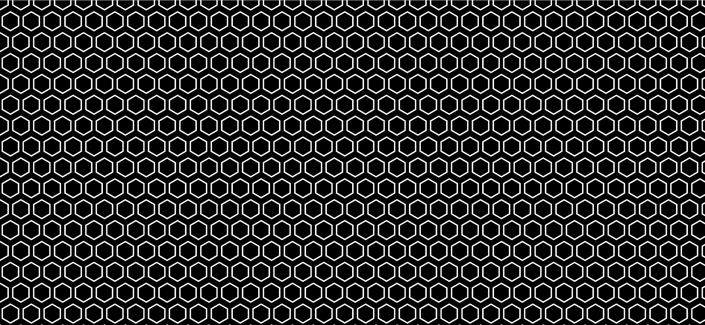
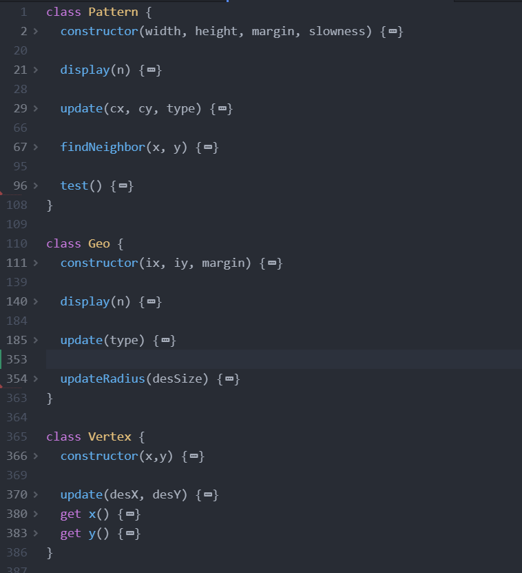

# Geo Wave
## Decoding Nature Final Project
Created By William Zhang [cz1627@nyu.edu](cz1627@nyu.edu)

### Project Link: https://mstxy.github.io/Geo-Wave/
#### Slide deck: https://docs.google.com/presentation/d/1ZYtaAwAQj7HiC9fZuDV3VNFxXsYTd49T-oy5QV8pb48/edit?usp=sharing

### Abstract 
This project uses p5.js and PoseNet in ml5.js to created an interactive geometric pattern that can be controlled through user movement. Through the interaction between basic geometries and human, this project aims to imitate how people tries to figure out the myth of nature and exploring the possibilities of the geometries to decode the nature. 

### Mechanisms
The original pattern is a hexagonal tile with white hexagon on black background. 

The mechanisms are as such: raising the left wrist will result in the hexagonal pattern changes in one direction and raising the right wrist will result in the hexagonal pattern changes in the opposite direction. The pattern will only change while the current changing pattern has stabilized. The pattern are changed through hexagonal spreading, from the center point calculated from the middle point of the two shoulders of the user. The available patterns are circulatory, meaning that if the user keeps raising the left hand, the pattern will change back to the original pattern in the opposite order as to if the user keeps raising the right hand. If all the available patterns have been explored, then the background lo-fi music will be triggered, and the patterns will now change automatically from a randomly calculated center point, and the order of pattern change will be controlled by a randomizer. Moreover, when the music starts playing, the background will have pulses corresponding to the amplitude of the background music.

### Inspiration
The overall inspiration is from the fact that p5.js has a complete geometry system, and everything we create using p5.js, no matter how complicated, are sort of based on these basic geometries. Similar to that, our nature, seems to also consist of basic geometries, where all complex things in the nature are no more than simple rules and simple geometries. This idea comes from the Fractal and Cellular Automata chapters of this course. In fractals, given a basic shape and a basic rule, a very complex shape could be created. For example, given one line with a length and a rule of splitting the line in two on one end within a range of angle and make some variation in the line length, a very life-like tree could be generated. In cellular automata, this idea goes even more extreme. By randomly exploring combinations of binary digits, discoveries that resembles real life problems and natural rules could be found. So the nature really is something intrinsitically simple but appears diversified and complicated. Therefore, through using poses to control the geometry pattern in this project, it is kind of like how ancient people tried to play around and experiment with the basic geometries and tring to get somethign extraodiary out of it.

### Tools & Design Process
First Sketch: 

The first sketch basically layout the elements of this project, without much viability concerns. So when I am actually implementing the draft into code, there are various issues. First issue is the transformation of individual geometric shapes. Because p5.js does not do things like automatic transition, so changing one shape into another would require a lot of careful decisions. The finally design ends up with three classes: Pattern - Geo - Vertex

With Pattern being the class for the whole pattern and Geo being the individual geometries and Vertex being the points in each geometry shape. To achieve the smooth transition, I write an update function for the Vertex class, where in each draw loop the vertex will move towards the destination by a bit. A state of true/false is also returned in order to stop the transition once destination is reached. The confusion here is that the draw() function in p5.js is called non-stop, but for my pattern transformation, it is continuous change in discrete steps, so a lot of boolean values are inserted in the code to guarantee the smooth control of the patterns. In the right part of the below sketch, it shows how I calculated the point coordinates for each vertex in each Geo.

Another issue I faced is the coding of the spread of geometric change. Because the geometries are laid out in hexagonal tiles, but I use 2D-array to store the Geo instances, the odd number rows are shifted horizontally by half of the margin. This is easy for static representation. But in the case of spreading, one Geo has six adjoining Geo. So for each spread, six adjoining Geo for each already updating Geo should be added to the update group. The thing is the finding adjoining Geo is different for odd and even rows. So in the end, the update is somthing like a recursive algorithm, with timers set to control the speed of the spread. I also have initiated a Set to record the updating Geos in order to avoid duplicates and also work seamlessly with the continuous nature of the draw() function in p5.js. In the middle part of the above sketch, it shows how I calculated the spreading pattern, and simulated the run by hand to evaluate the viability of my code.

Because I want to incorporate more complex shapes into the pattern, but using more complex shapes means using more vertexs in each geometric shape, so in the end I capped the number of vertexs to 9 - not so many to complicate the coding but enough to represent various shapes. The above sketch shows how the 9 vertexs position in some of the complex shapes. The upper row also shows the self turning mechanism of a hexagon shape.

For [PoseNet](https://learn.ml5js.org/#/reference/posenet) control, I followed the basic structure as the tutorial. PoseNet gives back from the webcam 17 keypoints, including left & right shoulder, left & right wrist and left & right elbow. The center point of the pattern spread is calculated from the average of leftShoulder.x and rightShoulder.x, as well as leftShoulder.y and rightShoulder.y. For controlling the pattern change, I originally use the elbow.y: if the leftElbow.y is higher than the average y of shoulders, then triggers change to the pattern\[i-1]. However, in testing, I found that PoseNet does not detect elbow very accuractely, especially when the user is just in front of the webcam. And it is not very user-friendly to ask the user to lift their elbow so high to trigger the animation. So I switched to the wrist position and kept the logic the same. Still, the finalized version suffers from the occasional fluccuation of the PoseNet posistions. But that is intrinsic to PoseNet and not really fixable. But through testing in multiple senarios, it seems that PoseNet works the best with the whole body in the webcam capture, that is, approximately 2 meters away from the webcam.

And in the end, because I found that the movement of geometric pattern and the spread of change is tranquilizing to watch. I decided to add lo-fi style music to the project after the user have explored all the patterns using their pose. After that point, the user would be freed from body movement, and could just enjoy the randomly spreading pattern with music and the pulsing backgound achieved using p5.Amplitude.getLevel() and a map function (which I also imagine it be good to be on a screensaver or the pc wallpaper). This design of reaching tranquility after some interaction with the geometry pattern appears to me as a process of decoding nature reaching a periodic success and pause. 

### Reflection 
Overall I am satisfied with how my initial idea gets successfully implemented and presented. But still there are spaces for improvement. I have asked the question about my project on whether it should be all black & white or colorful, but in the end I sticked with the B/W design because the less complicated it is, the more imagination could be brought into the project through the user. Also, when staring at the pattern, you could actually see some rainbow color hidden inside it, mostly due to optical illusion. But still, some experiment will different colors might add more fun to this project.
Moreover, originally I want to make it as a wave of changing geometries, but the capability of p5.js does not really allow me to do that. Firstly it is due to the lack of computational power, already now if I increase the amount of geometries the animation becomes very slow with low framerate. Secondly if I allow multiple animation goes on at the same time, I can not really think about how two different animation could merge together when the two waves touch. Therefore, I would really love to experiment with tools such as processing (which gives a better computation power considering complex animations) and Shaders (which seems to be more flexible and have more potential in dealing with geometric animations?).
